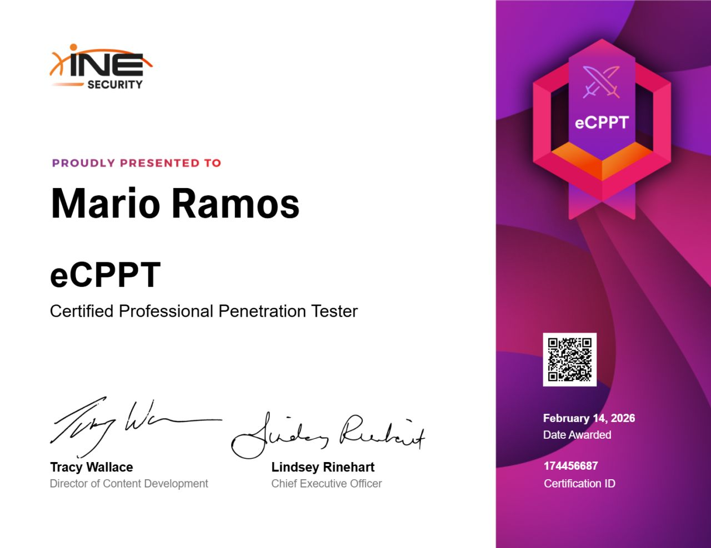

What's up, guys? How are you doing? My _nickname_ out there is **maariooors** or **mrsx0A** (which is the more alternative one), but well, my name is **Mario**. A few weeks ago I took the eCPPTv3 exam from INE eLearnSecurity, after studying for a couple of months and going through the entire course that INE has on its platform. After passing it, I honestly felt like I needed to talk a bit about this certification. So here goes my review of the [eCPPTv3](https://ine.com/security/certifications/ecppt-certification).

But first, look at and appreciate how beautiful this piece of digital paper is (AKA photo).

---

- [Context](#context)
- [eCPPTv2 vs eCPPTv3](#ecpptv2-vs-ecpptv3)
- [The INE Course](#the-ine-course)
- [What Is the Exam Like?](#what-is-the-exam-like)
- [Tips](#tips)
- [Is It Worth It?](#is-it-worth-it)
- [Cheatsheet to Pass 100% Guaranteed Not Fake v2](#cheatsheet-to-pass-100-guaranteed-not-fake-v2)

## Context

First of all, I'm going to give a bit of context about myself and how prepared I was when I went into this exam, in case it helps someone as a reference.

When I took the exam, I had already passed the [eJPTv3](https://ine.com/security/certifications/ejpt-certification), had completed several full sections of the **PortSwigger** labs, more specifically _(XXE, XSS, SSTI, SSRF, SQLi, LFI, JWT and CSRF)_, and I had just started my position as a **Pentester Intern**. Although, well, I could have taken the exam before starting my internship, but I didn't because I didn't have the time. So no, don't worry. You definitely do not need to be working as a pentesting intern to take on this exam.

Before getting into the review itself, I'd really like to talk a bit about eCPPTv2 vs eCPPTv3, because the difference is absurd.

## eCPPTv2 vs eCPPTv3

If at any point in your cert journey you got interested in the _eCPPTv2_ and read anything about it, you probably came away with 3 main things in mind.

1. A huge pivoting setup
2. Buffer Overflow
3. 14 days for the exam (7 for exploitation, 7 for the report)

And, to add a fourth one, the exam was done through a VPN using your own environment.

Weeell... things have changed, and a lot :(

There is **NO** more pivoting at all, like none whatsoever. There's more pivoting in the eJPTv3 than in this exam. And they have completely killed off the Buffer Overflow part (even though they didn't remove it from the course). But we'll talk more about that later. And of course, it's no longer 14 days with a VPN, now it's 24h in a **Guacamole** environment. Yeah, guacamole :(

But well, it's not all about removing stuff: they added a lot of **Active Directory**, both in the course and in the exam. But we'll talk about that when we get to that section.

## The INE Course

As for the course that INE provides for this exam, honestly, it doesn't look bad at all.

- Resource development and initial access
- Web application attacks
- Exploit development (Buffer Overflow)
- Post-exploitation
- Red Team (Active Directory and C2)

They promise around **53 hours** of videos, but that's not entirely true.

Starting from the fact that there is no longer any Buffer Overflow, we can skip that whole section. The same goes for the **Command and Control** (C2) part, since they are not necessary for the exam. If you want to learn a bit about them, that's fine, but not much more than that.

But well, the rest of the videos are not that bad. There are parts that really do feel like filler (at least to me), since I feel like they tell you things that are either recycled from the eJPTv3, or that are not really going to prepare you for the exam because they simply won't come up. There's a whole section of about **10h** on _phishing_ or _VBA Macros_ that, if you want to watch it, fine, but for the exam it's completely useless.

But the part that causes the most controversy is the whole Active Directory thing. Here I've got two opinions: one very good, and one very bad.

The part of the course that covers all the AD stuff is honestly pretty complete. In fact, for someone who has never touched AD before, it's super useful. It starts from 0, explains the structure of an AD in detail, explains how to enumerate the different services and protocols, covers attacks like **Kerberoasting**, **AS-REP Roasting** or **Password Spraying**, and also explains different types of privilege escalation or lateral movement such as **Pass-the-Hash**, **Pass-the-Ticket**, **Silver Ticket** and **Golden Ticket**.

But then, Mario, if all of this is explained, why are you complaining? Well, the problem is in *how* it is explained. And no, it's not the instructor at all. Alexis Ahmed is in charge of teaching the eJPT, eCPPT, eWPT and eWPTX courses, and as an instructor he is very good: he explains things really well and clearly knows what he's talking about. But the problem is that this whole AD part is taught entirely through an RDP connection to a Windows machine, using tools like **PowerView** or **PowerUp**.

But then, what's the problem? Well, in a real exam environment or a real red team exercise, they are not going to hand you an RDP connection to the victim machine. You are going to have to use your own Kali machine with different tools to get a connection on the victim machine. And that's the problem.

In the exam, they give you a Kali machine and basically tell you: "come on, get to work", and if all you did was watch the course and nothing else, you're going to have a problem, because you won't know how to use tools like **impacket** or **netexec**. So, what should you do? My biggest recommendation is that you watch the AD-related content, take notes on everything, and then go practice it all on your own to try to do everything that was explained in the videos, but instead of using **PowerView** or **PowerUp**, use the **impacket** _suite_, **netexec / crackmapexec**, and the rest of the tools that are normally used in this kind of exercise. (Don't worry, there's a little gift at the end of this post :)

## What Is the Exam Like?

And now, yes... the **EXAM!!!** This is where what is, for me, the worst part of this certification really shows up.

The exam consists of 5 machines:

- 1 website
- 4 machines that belong to an AD

> This is why it annoys me so much how badly they approached the Active Directory videos, since AD makes up close to 80% of the exam.

I'm not going to get into whether a VPN or a Guacamole environment is better (although I don't think there's much debate there), or whether the version 2 exam was better than version 3, because I can only talk about v3, since I don't have v2.

But honestly, the exam was a joke. It's **45 questions**, most of them multiple choice, except for a couple that are flags. And honestly, it leaves a lot to be desired from every angle.

My recommendation is that, before doing anything with the environment, you read all 45 questions and write down however you want which machine each question belongs to, because you might get stuck on one thing while having a hint or even the way forward a couple of questions later. And here comes the biggest problem: if you know how to interpret the multiple-choice questions well, it feels like the exam slowly guides you toward solving it.

But come on, Mario, it can't be *that* blatant... Well, honestly, yes, it can. It actually makes me a bit sad, to be honest, because this is an exam that, if designed properly, could be really, really cool.

And another very common complaint, one that I've seen in pretty much every review of this exam, is the brute force issue. It's honestly ridiculous: you can solve the entire exam through brute force, and I'm not even joking. In fact, once I finished the exam, I went online to check whether the problem was that I just didn't know how to exploit an AD and had to fall back on brute force, but I couldn't find a single place where someone said they had solved the exam without brute force.

So yes, it's a joke: they give you a whole AD that is only vulnerable to brute force and nothing else (at least that was the case in my exam, yours might be a bit different).

Just so you get an idea, I still remember, even though it's been almost a month, one question that said _"which of the following users is vulnerable to password spraying"_ and then gave you 4 options. That question was solved by making a list with those 4 users and throwing `rockyou.txt` at them. Yeah, rockyou. What kind of _"password spraying"_ is that supposed to be?

And that's it, that's the whole gimmick of the exam...

## Tips

As for advice, honestly, it's pretty much what I mentioned above: read the questions very carefully and, above all, **stay calm**. It took me 12h to finish the exam, and maybe all of a sudden you make a lot of progress in 2h and then spend 3 more getting nowhere. That's normal, you have to try everything. Maybe the thing you try just happens to work, or maybe you still need to keep testing more stuff.

Take breaks from time to time, there is more than enough time to complete the exam, so don't stress yourself out. Eat something, go for a walk, get some water to clear your head (and to get used to showering, because you probably don't do it much... :)

And the most useful piece of advice, and the one that makes me the saddest: there is a folder on the exam desktop with several wordlists. When you have to brute force, go from the smallest one to the biggest one, leaving `rockyou.txt` for last.

## Is It Worth It?

After everything I've said up to this point, this section feels a bit xd, but anyway, to the question of whether it's worth it?

Weeell... it depends, honestly. There are other exams in this _"professional"_ level range, like HackTheBox's **CPTS**, which already has a review on this blog (it's really good, definitely give it a look), that are much more complete and have way better reviews. But still, it's more expensive.

INE tends to run offers from time to time, and you can get the cert + course for around **300 euros**. At that price, I would actually consider taking it. It's true that the exam itself is not good at all, but whether you like it or not, through the videos, notes, and practicing the knowledge you pick up throughout the course, you do end up learning things. But with certs like the CPTS already on the market, I'd honestly take a good look at those first.

## Cheatsheet to Pass 100% Guaranteed Not Fake v2

That said, for anyone who wants to take the exam, I've got the following cheatsheet forged by Zeus himself.

> Terrible reference to this [joke](https://cdn.deephacking.tech/i/posts/ine-ecpptv2-review/ine-ecpptv2-review-3.avif) by Juan in the eCPPTv2 review.

No, seriously, for real this time: you can find this [eCPPTv3 cheatsheet](https://blog.deephacking.tech/en/posts/ine-ecpptv3-cheatsheet/) in another post on this blog where you'll find a cheatsheet split into sections that will be super useful when it comes to facing the exam.

And above all, best of luck, guys. You'll see, you'll pass it on the first try with no trouble at all :)