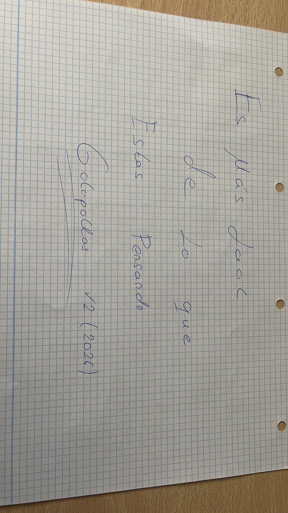

¿Qué pasa, chavales? ¿Cómo vais? Mi _apodo_ por ahí es **maariooors** o **mrsx0A** (que es más alternativo), pero vamos, que me llamo **Mario**. Hace unas semanas me examiné del eCPPTv3 de INE eLearnSecurity, después de haber estudiado un par de meses y de haberme hecho el curso entero que tiene INE en su plataforma. Tras aprobarlo, la verdad es que me quedé un poco con la necesidad de hablar al respecto de esta certificación. Así que aquí va mi review sobre el [eCPPTv3](https://ine.com/security/certifications/ecppt-certification).

Pero antes, mirad y apreciad qué bonito es este trozo de papel digital (AKA foto).

---

- [Contexto](#contexto)
- [eCPPTv2 vs eCPPTv3](#ecpptv2-vs-ecpptv3)
- [El curso de INE](#el-curso-de-ine)
- [¿Cómo es el examen?](#cómo-es-el-examen)
- [Consejos](#consejos)
- [¿Vale la pena?](#vale-la-pena)
- [Cheatsheet para aprobar 100% seguro no fake v2](#cheatsheet-para-aprobar-100-seguro-no-fake-v2)

## Contexto

Antes de nada, daré un poco de contexto acerca de mí y de cómo llegaba de preparado a este examen, por si a alguien le sirve de referencia.

Cuando me examiné, yo ya me había sacado el [eJPTv3](https://ine.com/security/certifications/ejpt-certification), había hecho varias secciones enteras de los laboratorios de **PortSwigger**, más específicamente _(XXE, XSS, SSTI, SSRF, SQLi, LFI, JWT y CSRF)_ y justo había empezado mi puesto como **Pentester Intern**. Aunque bueno, podría haberme examinado antes de empezar mis prácticas, pero no lo hice por falta de tiempo. Así que no, no te preocupes. No necesitas estar como becario en pentesting para enfrentarte al examen, ni mucho menos.

Antes de empezar la review en sí, me gustaría mucho hablar acerca del eCPPTv2 vs eCPPTv3, ya que la diferencia es absurda.

## eCPPTv2 vs eCPPTv3

Si en algún momento de vuestra etapa por las certis os habéis interesado por el _eCPPTv2_ y habéis leído algo acerca de él, probablemente os hayáis quedado con 3 cosas principales.

1. Un pivoting súper grande
2. Buffer Overflow
3. 14 días de examen (7 de explotación, 7 de informe)

Y, para añadir una cuarta, el examen se hacía a través de una VPN con tu propio entorno.

Pueeees... las cosas han cambiado, y mucho :(

Ya **NO** hay pivoting, pero nada de nada. Hay más pivoting en el eJPTv3 que en este examen. Y se han cargado por completo el tema del Buffer Overflow (aunque no lo han quitado del curso). Pero de eso hablaremos más adelante. Y como no, ya no son 14 días con VPN, ahora son 24h y en un entorno de **Guacamole**. Sí, guacamole :(

Pero bueno, no todo es quitar: han metido mucho **Active Directory**, tanto en el curso como en el examen. Pero de esto hablaremos cuando lleguemos a esa sección.

## El curso de INE

En relación al curso que proporciona INE para este examen, la verdad es que no tiene mala pinta.

- Desarrollo de recursos y acceso inicial
- Ataques a aplicaciones web
- Desarrollo de exploits (Buffer Overflow)
- Post-explotación
- Red Team (Active Directory y C2)

Se prometen unas **53 horas** de vídeos, pero esto no es del todo así.

Partiendo de la base de que ya no hay Buffer Overflow, toda esa sección podemos saltárnosla. Lo mismo pasa con la parte de **Command and Control** (C2), que no son necesarios para el examen. Si quieres aprender un poco acerca de ellos, está bien, pero poco más.

Pero bueno, el resto de vídeos no están del todo mal. Hay partes que sí son relleno (al menos para mí), ya que siento que son vídeos donde te cuentan cosas que o bien son recicladas del eJPTv3, o que realmente no te van a preparar para el examen, ya que no van a entrar. Hay una sección entera de unas **10h** acerca de _phishing_ o de _VBA Macros_ que, si te la quieres ver, bien, pero para el examen no sirve de nada.

Pero la parte que más genera controversia es el tema del Directorio Activo. Aquí yo tengo dos opiniones: una muy buena y otra muy mala.

La parte del curso que trata todo el tema del AD, la verdad, es que es bastante completa. De hecho, para alguien que no ha tocado AD jamás, es súper útil. Se parte de 0, se explica en detalle la estructura de un AD, se explica cómo enumerar los diferentes servicios y protocolos, se explican ataques como **Kerberoasting**, **AS-REP Roasting** o **Password Spraying**, y se explican diferentes tipos de escaladas de privilegios o movimientos laterales como **Pass-the-Hash**, **Pass-the-Ticket**, **Silver Ticket** y **Golden Ticket**.

Pero entonces, Mario, si se explica todo esto, ¿por qué te quejas? Pues el problema viene en cómo se explica. Y no, no es el profesor para nada. Alexis Ahmed se encarga de dar los cursos tanto del eJPT, eCPPT, eWPT y eWPTX, y como profesor es muy bueno: explica muy bien y sabe de lo que habla. Pero el problema es que esta parte de AD se explica toda con una conexión RDP a una máquina Windows y se usan herramientas como **PowerView** o **PowerUp**.

Pero y entonces, ¿cuál es el problema? Pues que, en un entorno de examen o de red team real, no te van a dar una conexión RDP a la máquina víctima. Tendrás tú que hacer uso de tu máquina Kali con diversas herramientas para conseguir una conexión en la máquina víctima. Y este es el problema.

En el examen te darán una máquina Kali y te dirán: "venga, ponte al lío", y si solo te has limitado a ver el curso y nada más, tendrás un problema, ya que no sabrás utilizar herramientas como **impacket** o **netexec**. Entonces, ¿qué hay que hacer? Mi mayor recomendación es que os veáis el contenido relacionado con AD, toméis nota de todo y después practiquéis vosotros por vuestra propia cuenta para intentar realizar todo lo que se ha explicado en los vídeos, pero en vez de con **PowerView** o **PowerUp**, con la _suite_ de **impacket**, **netexec / crackmapexec** y el resto de herramientas que se usan en este tipo de ejercicios. (No os preocupéis, que al final de este post hay regalito :)

## ¿Cómo es el examen?

Y ahora sí... el **EXAMEN!!!** Pues aquí sí que sí está lo que es, para mí, lo peor de esta certificación.

El examen consta de 5 máquinas:

- 1 página web
- 4 máquinas que pertenecen a un AD

> De aquí que me dé tanta rabia el mal enfoque que le han dado a los vídeos de Active Directory, ya que en el examen es cerca del 80 %.

No me voy a meter en el asunto de si es mejor una VPN o un entorno Guacamole (aunque yo creo que no hay mucho debate), o si era mejor el examen de la versión 2 o de la versión 3, ya que yo solo puedo hablar de la v3, porque la v2 no la tengo.

Pero la verdad es que el examen ha sido de risa. Son **45 preguntas**, la gran mayoría tipo test, a excepción de un par que son flags. Y la verdad es que deja que desear por todos lados.

Mi recomendación es que, antes de hacer nada con el entorno, os leáis las 45 preguntas y os apuntéis donde queráis a qué máquina corresponde cada pregunta, porque puede pasar que os quedéis atascados en una cosa y tengáis una pista o la forma de avanzar un par de preguntas más adelante. Y aquí viene el mayor problema: si sabéis interpretar bien las preguntas tipo test, parece que se os va guiando poco a poco a resolver el examen.

Pero bueno, Mario, tan descarado no será... Pues la verdad es que sí. Hasta me pone un poco triste, la verdad, porque es un examen que, si se plantea bien, puede salir muy, muy chulo.

Y otra queja muy repetida, y que prácticamente he leído en cualquier review acerca de este examen, es el tema de la fuerza bruta. Es algo completamente ofensivo: se puede resolver el examen entero a base de fuerza bruta, y no es broma. De hecho, una vez que acabé el examen, me fui a internet a ver si el problema era que yo no sabía explotar un AD y entonces tuve que recurrir a la fuerza bruta, pero no fui capaz de encontrar en ningún sitio a alguien que dijese haber resuelto el examen sin fuerza bruta.

Entonces sí, es de coña: te ponen un AD entero que solo es vulnerable a fuerza bruta y nada más (al menos ese fue el caso de mi examen, el tuyo puede ser algo diferente).

Pero para que os hagáis una idea, me acuerdo, aunque ya haya pasado cerca de 1 mes, de una pregunta que decía _"cuál de los siguientes usuarios es vulnerable a password spraying"_ y te daban 4 opciones. Esa pregunta se resolvía haciendo una lista con esos 4 usuarios y lanzándoles el `rockyou.txt`. Sí, el rockyou. ¿Qué clase de _"password spraying"_ es ese?

Y ya está, esa es la gracia del examen...

## Consejos

Como consejos, la verdad, pues un poco lo que he mencionado arriba: leer muy bien las preguntas y, sobre todo, **estate tranquilo**. Yo tardé 12h en acabar el examen, y a lo mejor de repente avanzas un montón en 2h y después pasas 3 sin conseguir nada. Es normal, hay que probar todo. Puede ser que justo lo que pruebes funcione o que sigas teniendo que probar más cosas.

Toma descansos de vez en cuando, hay tiempo más que de sobra para completar el examen, no te agobies. Come algo, date un paseo, bebe agua para refrescar la cabeza (y para coger la costumbre de ducharte, que seguro que lo haces poco... :) )

Y el consejo más útil, y que más pena me da: hay una carpeta en el escritorio del examen con varias wordlists. Cuando tengas que hacer fuerza bruta, usa de la más pequeña a la más grande, dejando para el final el `rockyou.txt`.

## ¿Vale la pena?

Después de todo lo que he soltado por la boca hasta aquí, este apartado queda un poco xd, pero bueno, a la pregunta de si ¿merece la pena?

Pueesss... depende, la verdad. Hay otros exámenes en este rango de nivel _"profesional"_ como el **CPTS** de HackTheBox, del cual tenéis una review en este blog (es muy buena, echadle un vistazo sin duda), que son bastante más completos y tienen muchísimas mejores críticas. Pero, no obstante, es más cara.

INE suele sacar de vez en cuando ofertas y se te puede quedar certi + curso en unos **300 euros**. Por este precio, yo sí me plantearía examinarme. Es verdad que el examen en sí no es bueno para nada, pero quieras o no, a base de vídeos, apuntes y practicar los conocimientos aprendidos a lo largo del curso, aprendes cosas, la verdad. Pero, estando en el mercado certis como el CPTS, la verdad es que yo les echaría un buen vistazo a esas antes.

## Cheatsheet para aprobar 100% seguro no fake v2

No obstante, para aquel que se quiera examinar, tengo la siguiente cheatsheet forjada por el mismísimo Zeus.

> Terrible referencia a esta [broma](https://cdn.deephacking.tech/i/posts/ine-ecpptv2-review/ine-ecpptv2-review-3.avif) de Juan en la reseña del eCPPTv2.

No, en serio, ahora de verdad: tenéis esta [cheatsheet del eCPPTv3](https://blog.deephacking.tech/es/posts/ine-ecpptv3-cheatsheet/) en otro post de este blog donde encontraréis una cheatsheet dividida por secciones que os va a ser súper útil a la hora de enfrentaros al examen.

Y, sobre todo, muchísima suerte, chavales. Ya veréis como lo sacáis a la primera y sin complicaciones :)